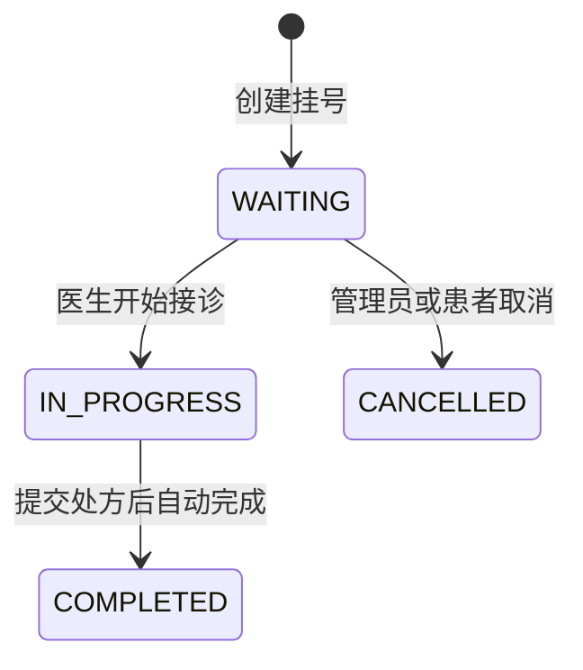
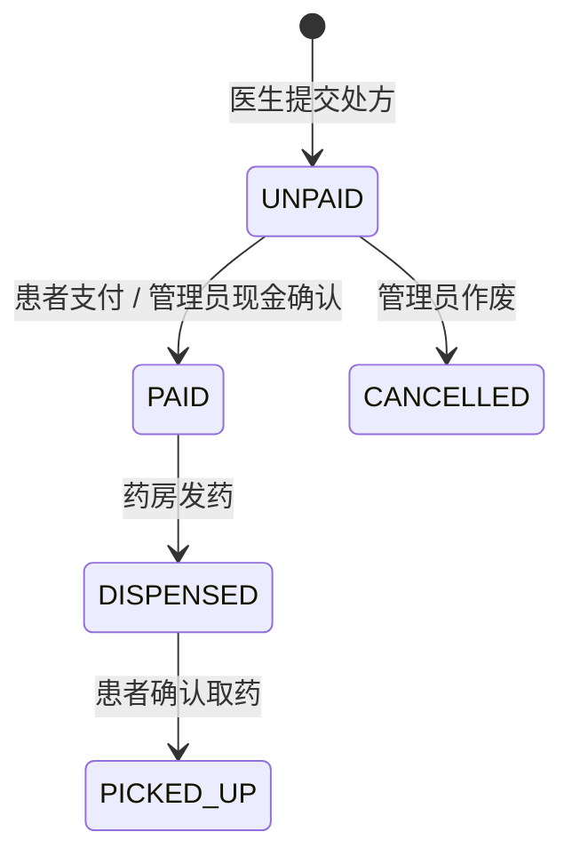

# 业务流程

## 门诊闭环

## 挂号状态

| 状态          | 含义     | 下一步             |
| ------------- | -------- | ------------------ |
| `WAITING`     | 等待接诊 | 开始接诊；取消     |
| `IN_PROGRESS` | 正在诊疗 | 保存病历；开具处方 |
| `COMPLETED`   | 接诊结束 | 查询历史           |
| `CANCELLED`   | 挂号取消 | 无                 |

同一患者、同一医生、同一天不能重复创建未取消号源；医生必须启用。

## 医生接诊与处方

1. 医生登录后，系统从会话的 `doctorId` 加载本人待诊队列。
2. 仅 `WAITING` 挂号可开始接诊，状态改为 `IN_PROGRESS`。
3. 医生只可读取或保存本人挂号的病历。
4. 仅接诊中的挂号可开处方；服务端校验药品数量和单价。
5. 服务端计算明细金额和处方总额，写入处方与明细后自动完成挂号。

## 处方状态

| 状态                      | 含义     | 谁可操作                                     |
| ------------------------- | -------- | -------------------------------------------- |
| `UNPAID`                  | 待缴费   | 患者支付；未注册患者可现金确认；管理员可作废 |
| `PAID`                    | 等待药房 | 药房发药                                     |
| `DISPENSED`               | 已发药   | 对应患者确认取药                             |
| `PICKED_UP` / `CANCELLED` | 已结束   | 无                                           |

发药会创建取药通知；确认取药会同步将该处方关联通知标记为已读。

## 并发与权限保护

- 状态更新带旧状态条件，重复点击时只有一个请求能成功。
- 患者端校验当前 `patientId` 是否拥有该挂号或处方。
- 医生端校验当前 `doctorId` 是否拥有该挂号。
- 已注册患者不能由管理员代为现金确认，避免绕过患者端支付。
