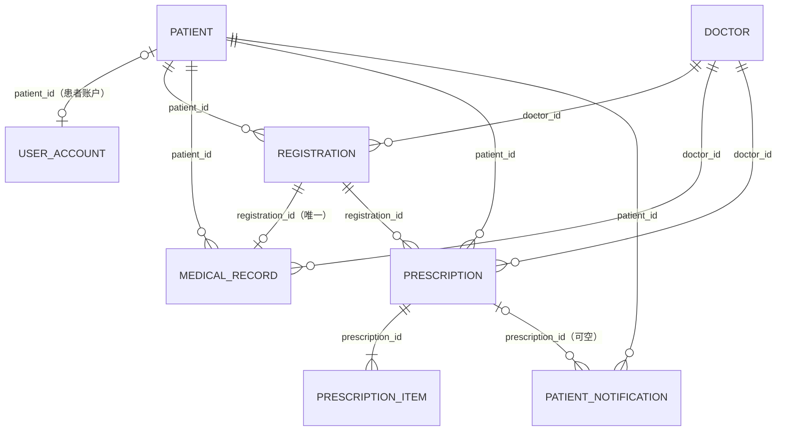

# 数据表关系

数据库由 `sql/init.sql` 创建，库名为 `cloud_hospital`，共八张业务表。

## ER 图

> 医生账户没有数据库外键：`user_account.username` 与 `doctor.login_name` 使用同名约定关联，登录时据此取得 `doctorId`。患者账户则通过 `user_account.patient_id` 外键关联。

## 表职责

| 表 | 主键 | 作用 |
| --- | --- | --- |
| `patient` | `id` | 患者基础档案 |
| `doctor` | `id` | 医生基础档案与在岗状态 |
| `user_account` | `id` | 管理员、医生、患者的登录账户和会话 Token |
| `registration` | `id` | 一次挂号及接诊状态 |
| `medical_record` | `id` | 一次挂号对应的病历 |
| `prescription` | `id` | 处方、支付、发药和取药状态 |
| `prescription_item` | `id` | 处方内的药品行 |
| `patient_notification` | `id` | 面向患者的取药等通知 |

## 关键字段与关系

### 患者、医生与账户

| 表 | 关键字段 | 关系和规则 |
| --- | --- | --- |
| `patient` | `patient_no`、`id_card` 均唯一 | 被账户、挂号、病历、处方、通知引用 |
| `doctor` | `doctor_no`、`login_name` 均唯一；`enabled` 控制是否可挂号和登录 | 被挂号、病历、处方引用 |
| `user_account` | `username` 唯一；`role` 为 `ADMIN`、`DOCTOR`、`PATIENT`；`auth_token` 唯一可空 | 患者账户使用唯一外键 `patient_id`；医生以 `username = login_name` 约定关联 |

管理员账户不关联患者或医生档案。`doctor.password_hash` 为现有档案字段，实际登录校验统一使用 `user_account.password_hash`。

### 就诊、病历与处方

| 表 | 关键字段 | 外键 / 约束 |
| --- | --- | --- |
| `registration` | `visit_no` 唯一；`visit_date`、`registration_fee`、`status` | `patient_id → patient`；`doctor_id → doctor`；索引支持按医生日期状态查询队列 |
| `medical_record` | `registration_id` 唯一；病史、检查、诊断、医嘱 | 分别引用挂号、患者、医生；一次挂号最多一份病历 |
| `prescription` | `prescription_no` 唯一；`status`、`total_amount`、支付/发药/取药时间 | 分别引用挂号、患者、医生；状态为 `UNPAID`、`PAID`、`DISPENSED`、`PICKED_UP`、`CANCELLED` |
| `prescription_item` | 药品、规格、单价、数量、行金额 | `prescription_id → prescription`；`quantity > 0`、`unit_price >= 0` |
| `patient_notification` | 类型、标题、内容、已读时间 | `patient_id → patient`；可选 `prescription_id → prescription` |

## 数据库与应用层约束

| 类型 | 内容 |
| --- | --- |
| 唯一键 | 患者编号、身份证号、医生编号、医生登录名、用户名、流水号、处方号唯一 |
| 一对一 | `medical_record.registration_id` 唯一；`user_account.patient_id` 唯一 |
| 外键 | 诊疗、处方和通知不能引用不存在的患者、医生、挂号或处方 |
| 应用层 | 同患者同日不可重复挂同一医生的未取消号源；状态只能按既定方向流转；医生只能操作本人挂号 |
| 特殊点 | 一次接诊一张处方由接诊状态保证；数据库未对 `prescription.registration_id` 加唯一约束 |

状态如何流转请见[业务流程](./业务流程.md)。
