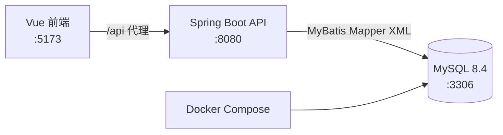

# 项目概览

## 项目目标

云医院是一个前后端分离的门诊诊疗闭环示例系统，覆盖患者建档和自助挂号、医生接诊和开方、收费、药房发药，以及患者支付和确认取药。

## 技术结构

| 层次     | 技术                       | 职责                               |
| -------- | -------------------------- | ---------------------------------- |
| 前端     | Vue 3、Vite、Element Plus  | 管理员工作台、医生工作站、患者服务 |
| 后端     | Java 17、Spring Boot 3.3.5 | REST API、鉴权和业务规则           |
| 数据访问 | MyBatis XML                | 执行 SQL，并映射为 Java 对象       |
| 数据库   | MySQL 8.4                  | 保存账号、诊疗、处方和通知         |
| 本地编排 | Docker Compose             | 启动 MySQL 及其健康检查            |



## 目录职责

| 目录 / 文件                                          | 说明                                                         |
| ---------------------------------------------------- | ------------------------------------------------------------ |
| `hospital-web/src`                                   | 前端入口、页面与 HTTP 客户端；`App.vue` 按会话角色切换工作台 |
| `hospital-server/src/main/java`                      | 控制器、服务、实体与鉴权拦截器                               |
| `hospital-server/src/main/resources/mapper`          | MyBatis XML SQL                                              |
| `hospital-server/src/main/resources/application.yml` | 端口、数据源和 MyBatis 配置                                  |
| `sql/init.sql`                                       | 唯一初始化脚本：建库、建表、演示数据                         |
| `compose.yaml`                                       | MySQL 容器、数据卷与健康检查                                 |

## 角色与权限

| 角色      | 主要功能                                     | 路由边界                         |
| --------- | -------------------------------------------- | -------------------------------- |
| `ADMIN`   | 患者/医生建档、挂号、收费、发药、运营概览    | 除认证、患者端、医生端以外的 API |
| `DOCTOR`  | 仅查看本人队列、接诊、病历和处方             | `/api/v1/doctor-workstation/**`  |
| `PATIENT` | 自助挂号、取消、支付、看药品和通知、确认取药 | `/api/v1/patient-portal/**`      |

`AuthInterceptor` 从 Bearer Token 或 Cookie 读取会话并校验角色。医生工作站还会以会话内的 `doctorId` 校验挂号归属，因此医生不能操作其他医生的患者。

## 核心模块

| 模块       | 核心代码                             | 职责                                 |
| ---------- | ------------------------------------ | ------------------------------------ |
| 认证       | `auth`                               | 登录、患者注册、医生注册、Token 续期 |
| 基础档案   | `patient`、`doctor`                  | 管理患者和医生信息；医生注册自动建档 |
| 挂号       | `registration`                       | 创建、排队、开始接诊、取消、完成     |
| 医生工作站 | `doctor/DoctorWorkstationController` | 用当前会话确定医生并限制为本人队列   |
| 病历       | `medicalrecord`                      | 保存和读取一次接诊的病历             |
| 处方       | `prescription`                       | 金额计算、支付、发药、取药、通知     |
| 患者门户   | `portal`                             | 聚合本人挂号、处方、药品和通知       |
| 运营概览   | `dashboard`                          | 汇总患者、医生、挂号和处方状态       |

## 认证入口

| 方法   | 路径                           | 用途                             |
| ------ | ------------------------------ | -------------------------------- |
| `POST` | `/api/v1/auth/login`           | 管理员、医生、患者登录           |
| `POST` | `/api/v1/auth/register`        | 患者注册并关联或创建患者档案     |
| `POST` | `/api/v1/auth/doctor-register` | 医生注册并创建医生档案和医生账户 |

成功后会返回会话和 Token；前端按 `role` 渲染对应工作台。

## 常用验证命令

```powershell
Set-Location hospital-server
mvn test

Set-Location ..\hospital-web
npm run build
```

完整启动步骤请见[环境搭建指南](./环境搭建指南.md)。
